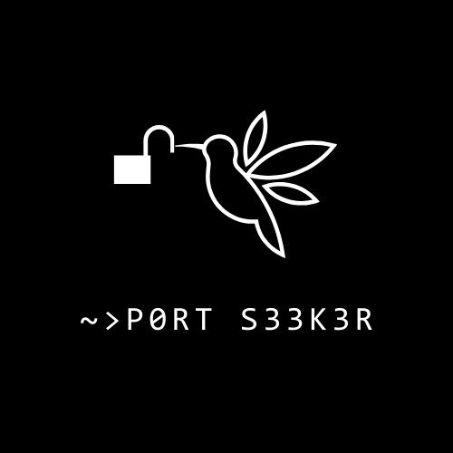
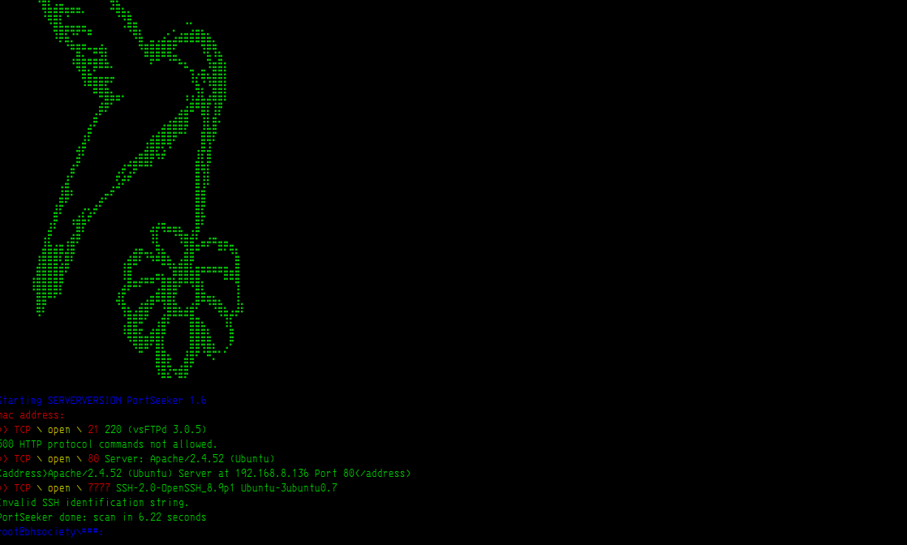
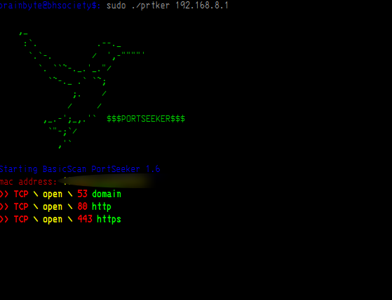

   ```markdown
   # PortSeeker

   PortSeeker is a powerful tool designed for network administrators and security professionals. It combines port scanning capabilities with vulnerability assessment using the National Vulnerability Database (NVD) API. This allows users to quickly identify potential security risks in their network environments.

   ## Table of Contents
   - [Features](#features)
   - [Setup](#setup)
   - [Usage](#usage)
   - [Contributing](#contributing)
   - [License](#license)
   - [Troubleshooting](#troubleshooting)
   - [Technology Stack](#technology-stack)
   - [Code of Conduct](#code-of-conduct)

   ## Features
   - Port scanning using nmap
   - Service version detection
   - Vulnerability assessment using NVD API
   - Rate-limited API requests
   - Asynchronous processing

   ## Setup
   1. Clone the repository:
      ```sh
      git clone https://github.com/yourusername/portseeker.git
      cd portseeker
      ```
   2. Create a virtual environment and activate it:
      ```sh
      python -m venv venv
      source venv/bin/activate  # On Windows, use `venv\Scripts\activate`
      ```
   3. Install the required packages:
      ```sh
      pip install -r requirements.txt
      ```
   4. Create a `.env` file in the project root and add your NVD API key:
      ```sh
      NVD_API_KEY=your_api_key_here
      ```

   ## Usage
   Run the script with a target IP or hostname:
   ```sh
   python portseeker.py 192.168.1.1
   ```

   ## Contributing
   Contributions are welcome! Please feel free to submit a Pull Request.

   ## Troubleshooting
   - **Issue: `ModuleNotFoundError` when running the script.**
     - Solution: Ensure all dependencies are installed by running `pip install -r requirements.txt`.
   - **Issue: API key not working.**
     - Solution: Verify that your API key is correct and has not expired. You can obtain a new API key from the NVD website if necessary.

   ## Technology Stack
   - Python
   - Nmap
   - Requests
   - Python-dotenv
   - Tenacity

   ## Project Structure

   - **`.gitignore`**: This file specifies intentionally untracked files that Git should ignore. It includes:
     - `.env` file to prevent sensitive information from being committed.
     - Python compiled files (`*.pyc`, `__pycache__/`).
     - Virtual environment directory (`venv/`).
     - Log files (`*.log`).
     - IDE-specific files (`.vscode/`, `.idea/`).

   - **`setup.py`**: This file is used for packaging and distribution. It includes:
     - Project metadata such as name, version, author, and description.
     - Dependencies required for the project.
     - Entry points for console scripts.
     - Classifiers for categorizing the project.

   ## Code of Conduct
   Please note that this project is released with a [Contributor Code of Conduct](CODE_OF_CONDUCT.md). By participating in this project, you agree to abide by its terms.

   ## PortSeeker version: 1.6
   <center>
       <br>
       
       
   </center>
   * 
   Port Scanner, opensource and programmed in C++ for linux distros.

   ### Free Open-Source vulnerability scanner
   #### For arch based distros
   ```
   pacman -S curl
   g++ compile.cpp -o prtker -std=c++11 -lcurl
   ```
   #### For debian based distros
   ```
   sudo bash start.sh
   ./prtker
   ```
   ### execute
   ```
   ./prtker
   ```
   ### Commands
   ```
   !!!!!everything must be run as root!!!!

   ./prtker 192.168.0.1 ---> BasicScan
   ./prtker 192.168.0.1 -sV ---> Port Version Scan
   ./prtker 192.168.0.1 -p 80 ---> specific port
   ```
   ## Improvements:
   ```
   >>> Optimized code
   >>> new port version scanning function
   >>> New colors on console ***
   >>> New feature for quieter network scans
   >>> Feature to obtain server status code
   >>> Performance improvement
   >>> Friendlier Banner and UI
   ```

   ## Authors
   @DigitalNinja00
   @jsposu
   @Cr0w-ui
   @elliotsecops